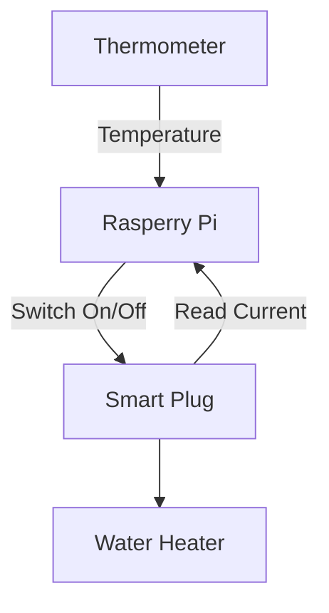

# Model Predictive Control Controller For Electric Water Heater

Optimise the heating strategy for electric water heaters with MPC. Simulated FCR-D for the DK2 energy grid is used for cost optimisations.

## Prerequisites 

This project uses [uv](https://docs.astral.sh/uv/getting-started/installation/) for Python package management. 

Sync Python packages: 

```bash
uv sync
```

## Devices Used



* **Rasperry Pi 3 B+**: Acts as the controller and server. This is where the MPC code runs. Switches the smart plug on and off and reads its current. Connected to the thermometer in order to read internal electric water heater temperature.
* **Shelly Plug S Gen3**: Smart plug that allows for local wifi communication through HTTP. Reads current frequency in the grid and current used.
* **Thermometer - DS18B20**: Allows for reading temperatures. This specific model is waterproof and allows for temperature readings in the range [-55 °C, 155 °C].

## Running

Run with uv: 

```bash
uv run src/main.py 
```

## Testing 

```bash 
uv run pytest
```